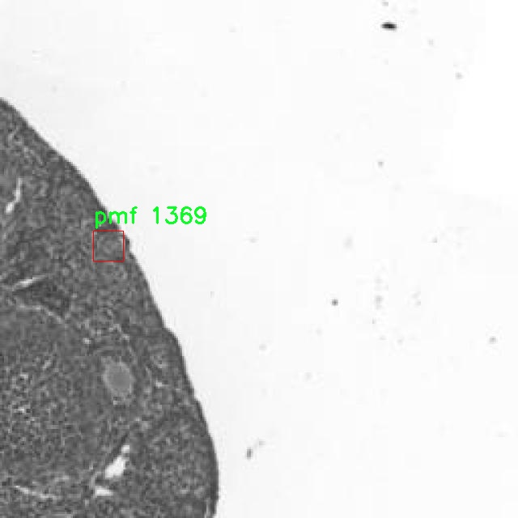

# 肽质量指纹图谱提取区域检测检测系统源码分享
 # [一条龙教学YOLOV8标注好的数据集一键训练_70+全套改进创新点发刊_Web前端展示]

### 1.研究背景与意义

项目参考[AAAI Association for the Advancement of Artificial Intelligence](https://gitee.com/qunshansj/projects)

项目来源[AACV Association for the Advancement of Computer Vision](https://gitee.com/qunmasj/projects)

研究背景与意义

在生物医学研究和药物开发领域，肽作为生物活性分子的关键组成部分，受到越来越多的关注。肽质量指纹图谱的提取与分析，能够为新药的发现、疾病的诊断及生物标志物的筛选提供重要的信息。然而，传统的肽质量指纹图谱分析方法往往依赖于人工经验，存在效率低、准确性差等问题。因此，开发一种高效、准确的肽质量指纹图谱提取区域检测系统显得尤为重要。

近年来，深度学习技术的迅猛发展为图像处理和分析提供了新的解决方案。YOLO（You Only Look Once）系列模型以其高效的实时目标检测能力，逐渐成为计算机视觉领域的研究热点。YOLOv8作为该系列的最新版本，具备更强的特征提取能力和更快的推理速度，适合用于复杂的生物医学图像分析任务。通过对YOLOv8模型的改进，可以更好地适应肽质量指纹图谱的特征，提升肽的检测精度和速度。

本研究旨在基于改进的YOLOv8模型，构建一个肽质量指纹图谱提取区域检测系统。该系统将利用包含2500张图像的数据集，针对两类肽（pf和pmf）进行目标检测。通过对数据集的深入分析与模型的优化，我们期望能够实现对肽质量指纹图谱中目标区域的高效提取与识别。这不仅能够提升肽的检测效率，还能为后续的定量分析和功能研究提供坚实的基础。

在实际应用中，肽质量指纹图谱的提取和分析在药物研发、临床诊断及个性化医疗等领域具有广泛的应用前景。通过构建高效的检测系统，可以显著提高肽的筛选效率，降低实验成本，加速新药的研发进程。此外，该系统的成功实施也将为生物信息学和计算生物学领域提供新的研究思路和方法，推动相关技术的发展。

综上所述，基于改进YOLOv8的肽质量指纹图谱提取区域检测系统的研究，不仅具有重要的理论意义，还具备广泛的应用价值。通过这一研究，我们期望能够为肽的检测与分析提供新的技术手段，推动生物医学研究的进展，最终为人类健康作出贡献。

### 2.图片演示


##### 注意：由于此博客编辑较早，上面“2.图片演示”和“3.视频演示”展示的系统图片或者视频可能为老版本，新版本在老版本的基础上升级如下：（实际效果以升级的新版本为准）

  （1）适配了YOLOV8的“目标检测”模型和“实例分割”模型，通过加载相应的权重（.pt）文件即可自适应加载模型。

  （2）支持“图片识别”、“视频识别”、“摄像头实时识别”三种识别模式。

  （3）支持“图片识别”、“视频识别”、“摄像头实时识别”三种识别结果保存导出，解决手动导出（容易卡顿出现爆内存）存在的问题，识别完自动保存结果并导出到tempDir中。

  （4）支持Web前端系统中的标题、背景图等自定义修改，后面提供修改教程。

  另外本项目提供训练的数据集和训练教程,暂不提供权重文件（best.pt）,需要您按照教程进行训练后实现图片演示和Web前端界面演示的效果。

### 3.视频演示

[3.1 视频演示](https://www.bilibili.com/video/BV1BrpjebE8L/)

### 4.数据集信息展示

##### 4.1 本项目数据集详细数据（类别数＆类别名）

nc: 2
names: ['pf', 'pmf']


##### 4.2 本项目数据集信息介绍

数据集信息展示

在本研究中，我们采用了名为“1-2”的数据集，以支持改进YOLOv8的肽质量指纹图谱提取区域检测系统的训练与验证。该数据集的设计旨在为肽质量指纹图谱的分析提供丰富的样本，助力于提升检测系统的准确性和效率。数据集包含两个主要类别，分别为“pf”和“pmf”，这些类别的选择是基于肽质量指纹图谱分析的实际需求而定，旨在捕捉和识别不同类型的肽质量特征。

在数据集的构建过程中，我们注重样本的多样性和代表性，以确保模型在实际应用中的泛化能力。数据集中的“pf”类别代表了特定的肽质量指纹特征，这些特征通常与特定的生物分子或化合物相关联。通过对这些特征的深入分析，我们可以提取出有价值的信息，进而为生物医学研究提供支持。另一方面，“pmf”类别则涵盖了另一类肽质量指纹特征，这些特征可能与不同的生物过程或病理状态相关联。通过对这两个类别的全面分析，我们期望能够建立一个更加精确的检测系统，以便在实际应用中实现高效的肽质量指纹图谱分析。

数据集“1-2”的构建过程不仅仅是简单的数据收集，更是一个系统化的过程，涉及到数据的预处理、标注和验证。我们通过严格的标准对数据进行标注，确保每个样本的类别信息准确无误。此外，为了提高模型的鲁棒性，我们在数据集中引入了多种数据增强技术，包括旋转、缩放、翻转等操作，以增加样本的多样性，帮助模型更好地适应不同的输入条件。

在训练过程中，我们将“1-2”数据集与改进后的YOLOv8模型相结合，充分利用YOLOv8在目标检测方面的优势。通过对模型进行多轮训练和验证，我们能够不断优化模型的参数设置，提升其在肽质量指纹图谱提取区域的检测精度。与此同时，我们还会对模型的性能进行评估，使用多种指标来衡量其在不同类别上的表现，以确保模型能够在实际应用中达到预期的效果。

总之，数据集“1-2”在本研究中扮演了至关重要的角色，它不仅为改进YOLOv8的肽质量指纹图谱提取区域检测系统提供了坚实的基础，也为后续的研究和应用奠定了良好的基础。通过对该数据集的深入分析和研究，我们期待能够推动肽质量指纹图谱分析技术的发展，为生物医学领域的研究提供更为精准和高效的工具。





### 5.全套项目环境部署视频教程（零基础手把手教学）

[5.1 环境部署教程链接（零基础手把手教学）](https://www.ixigua.com/7404473917358506534?logTag=c807d0cbc21c0ef59de5)


[5.2 安装Python虚拟环境创建和依赖库安装视频教程链接（零基础手把手教学）](https://www.ixigua.com/7404474678003106304?logTag=1f1041108cd1f708b01a)

### 6.手把手YOLOV8训练视频教程（零基础小白有手就能学会）

[6.1 手把手YOLOV8训练视频教程（零基础小白有手就能学会）](https://www.ixigua.com/7404477157818401292?logTag=d31a2dfd1983c9668658)

### 7.70+种全套YOLOV8创新点代码加载调参视频教程（一键加载写好的改进模型的配置文件）

[7.1 70+种全套YOLOV8创新点代码加载调参视频教程（一键加载写好的改进模型的配置文件）](https://www.ixigua.com/7404478314661806627?logTag=29066f8288e3f4eea3a4)

### 8.70+种全套YOLOV8创新点原理讲解（非科班也可以轻松写刊发刊，V10版本正在科研待更新）

由于篇幅限制，每个创新点的具体原理讲解就不一一展开，具体见下列网址中的创新点对应子项目的技术原理博客网址【Blog】：


[8.1 70+种全套YOLOV8创新点原理讲解链接](https://gitee.com/qunmasj/good)

### 9.系统功能展示（检测对象为举例，实际内容以本项目数据集为准）

图9.1.系统支持检测结果表格显示

  图9.2.系统支持置信度和IOU阈值手动调节

  图9.3.系统支持自定义加载权重文件best.pt(需要你通过步骤5中训练获得)

  图9.4.系统支持摄像头实时识别

  图9.5.系统支持图片识别

  图9.6.系统支持视频识别

  图9.7.系统支持识别结果文件自动保存

  图9.8.系统支持Excel导出检测结果数据


### 10.原始YOLOV8算法原理

原始YOLOv8算法原理

YOLOv8算法是目标检测领域的一项重要进展，继承了YOLO系列的优良传统，同时在多个方面进行了创新和优化。该算法的设计目标是提高检测精度和速度，尤其是在处理复杂场景和多尺度目标时，展现出更为卓越的性能。YOLOv8的架构主要由三个核心部分组成：骨干特征提取网络、特征融合层和检测头层。通过对这些部分的精细调整，YOLOv8实现了更高效的特征提取和信息融合。

在骨干特征提取网络层，YOLOv8采用了C2F模块替代了YOLOv5中的C3模块。这一变化不仅使得网络结构更加轻量化，还增强了模型在特征提取过程中的灵活性和表达能力。C2F模块通过引入更多的分支结构，丰富了梯度回传时的支流，从而提升了网络的学习能力。具体而言，C2F模块的设计允许在不同层次之间进行更有效的特征传递，使得模型能够更好地捕捉到图像中的细节信息。

特征融合层是YOLOv8的另一大亮点。该层结合了特征金字塔网络（FPN）和路径聚合网络（PAN）的优点，通过双向跨尺度连接和加权特征融合，提升了模型对不同尺度特征信息的提取速度和准确性。FPN负责在不同层次之间进行特征的上下传递，而PAN则进一步优化了特征的聚合过程。为了进一步减轻模型的计算负担，YOLOv8在特征融合网络中引入了BiFPN网络。这一设计通过删除单输入对应的节点，并在同一层的输入输出节点之间添加连接，极大地提高了特征融合的效率，使得YOLOv8在处理多尺度目标时表现得更加出色。

在检测头层，YOLOv8采用了轻量化的解耦头结构，取代了之前的耦合头。这一创新使得分类和定位任务可以通过两条并行的分支独立进行，分别提取类别特征和位置特征。通过这种解耦设计，YOLOv8能够更好地处理复杂的目标检测任务，减少了任务之间的干扰，提高了整体的检测精度。

数据预处理方面，YOLOv8延续了YOLOv5的策略，采用了多种增强手段，包括马赛克增强、混合增强、空间扰动和颜色扰动等。这些增强技术的引入，不仅丰富了训练数据的多样性，还有效提升了模型的鲁棒性，使其在面对不同环境和条件下的目标检测任务时，依然能够保持较高的性能。

在标签分配策略上，YOLOv8引入了动态标签分配策略，解决了正负样本匹配的多尺度分配问题。与YOLOX的SimOTA不同，YOLOv8采用了与YOLOv6相同的TOOD策略，主要通过target bboxes和target scores进行处理。这一策略的优势在于，它能够更准确地反映数据集的分布特征，从而提高模型的学习效率和检测效果。

损失函数方面，YOLOv8引入了Varifocal Loss（VFL）和CIoU Loss与DFL Loss的组合形式。VFL通过不对称参数对正负样本进行加权，特别强调了高质量正样本在训练过程中的重要性。这种设计使得模型在训练时能够更专注于那些对最终检测结果影响较大的样本，从而有效提升了模型的AP（Average Precision）值。

总的来说，YOLOv8在原有YOLO系列的基础上，通过对网络结构、特征提取、特征融合、检测头和损失函数等多个方面的创新与优化，显著提升了目标检测的性能。其轻量化设计不仅降低了计算复杂度，还保证了在多种应用场景下的高效性和准确性。这使得YOLOv8成为了当前目标检测领域的一项重要工具，广泛应用于智能监控、自动驾驶、无人机视觉等多个领域，推动了计算机视觉技术的进一步发展。


### 11.项目核心源码讲解（再也不用担心看不懂代码逻辑）

#### 11.1 code\ultralytics\data\utils.py

以下是经过简化和注释的核心代码部分，主要集中在数据集处理和验证功能上：

```python
import os
import hashlib
from pathlib import Path
from PIL import Image, ImageOps
import numpy as np

# 定义支持的图像格式
IMG_FORMATS = ("bmp", "jpeg", "jpg", "png", "tif", "tiff", "webp")

def img2label_paths(img_paths):
    """根据图像路径生成标签路径"""
    # 将图像路径中的'images'替换为'labels'，并将后缀改为.txt
    return [x.replace('/images/', '/labels/').rsplit(".", 1)[0] + ".txt" for x in img_paths]

def get_hash(paths):
    """计算给定路径列表的哈希值"""
    size = sum(os.path.getsize(p) for p in paths if os.path.exists(p))  # 计算文件大小总和
    h = hashlib.sha256(str(size).encode())  # 生成哈希
    h.update("".join(paths).encode())  # 更新哈希以包含路径
    return h.hexdigest()  # 返回哈希值

def exif_size(img: Image.Image):
    """返回经过EXIF校正的图像大小"""
    s = img.size  # 获取图像大小
    if img.format == "JPEG":  # 仅支持JPEG格式
        exif = img.getexif()  # 获取EXIF信息
        if exif:
            rotation = exif.get(274, None)  # 获取方向信息
            if rotation in [6, 8]:  # 处理旋转情况
                s = s[1], s[0]  # 交换宽高
    return s

def verify_image(im_file):
    """验证单个图像文件的有效性"""
    nf, nc, msg = 0, 0, ""
    try:
        im = Image.open(im_file)  # 打开图像
        im.verify()  # 验证图像
        shape = exif_size(im)  # 获取图像大小
        assert (shape[0] > 9) & (shape[1] > 9), f"图像大小 {shape} 小于10像素"
        assert im.format.lower() in IMG_FORMATS, f"无效的图像格式 {im.format}"
        nf = 1  # 图像有效
    except Exception as e:
        nc = 1  # 图像无效
        msg = f"警告 ⚠️ {im_file}: 忽略损坏的图像: {e}"
    return im_file, nf, nc, msg

def verify_image_label(im_file, lb_file):
    """验证图像及其对应标签的有效性"""
    nf, nc, msg = 0, 0, ""
    try:
        # 验证图像
        im = Image.open(im_file)
        im.verify()
        shape = exif_size(im)
        assert (shape[0] > 9) & (shape[1] > 9), f"图像大小 {shape} 小于10像素"
        
        # 验证标签
        if os.path.isfile(lb_file):
            nf = 1  # 标签存在
            with open(lb_file) as f:
                lb = [x.split() for x in f.read().strip().splitlines() if len(x)]
                lb = np.array(lb, dtype=np.float32)  # 转换为numpy数组
            # 检查标签有效性
            assert lb.shape[1] == 5, f"标签需要5列, 检测到 {lb.shape[1]} 列"
            assert lb.min() >= 0, f"标签值不能为负 {lb[lb < 0]}"
        else:
            msg = f"警告 ⚠️ {im_file}: 标签缺失"
            nc = 1  # 标签缺失
    except Exception as e:
        nc = 1
        msg = f"警告 ⚠️ {im_file}: 忽略损坏的图像/标签: {e}"
    return im_file, nf, shape, msg

def check_det_dataset(dataset):
    """检查检测数据集的有效性"""
    # 读取数据集的yaml文件
    file = Path(dataset)
    assert file.exists(), f"数据集未找到: {dataset}"
    
    # 解析yaml文件
    data = yaml_load(file)  # 假设yaml_load是一个解析yaml文件的函数
    for k in ["train", "val"]:
        assert k in data, f"数据集缺少 '{k}' 键"
    
    # 处理路径
    path = Path(data.get("path", "")).resolve()
    data["path"] = path  # 设置数据集路径
    return data  # 返回数据集信息
```

### 代码说明：
1. **img2label_paths**: 将图像路径转换为标签路径。
2. **get_hash**: 计算给定路径列表的哈希值，确保文件的唯一性。
3. **exif_size**: 处理JPEG图像的EXIF信息，返回校正后的图像大小。
4. **verify_image**: 验证单个图像文件的有效性，包括格式和大小检查。
5. **verify_image_label**: 验证图像及其对应标签的有效性，确保标签存在且格式正确。
6. **check_det_dataset**: 检查数据集的有效性，确保必要的键存在并解析yaml文件。

以上代码为核心功能部分，注释详细说明了每个函数的作用和实现逻辑。

这个文件是Ultralytics YOLO项目中的一个工具模块，主要用于处理数据集相关的操作，包括图像和标签的验证、数据集的下载和解析、以及一些图像处理功能。以下是对文件中各个部分的详细讲解。

首先，文件导入了一些必要的库，包括用于文件和路径操作的`os`和`pathlib`，用于图像处理的`PIL`和`cv2`，以及用于数据处理的`numpy`。此外，还引入了一些Ultralytics自定义的工具函数和常量。

文件中定义了一些常量，例如支持的图像和视频格式，以及全局的`PIN_MEMORY`设置，这对于数据加载器的性能优化是有帮助的。

接下来，定义了一些函数。`img2label_paths`函数根据图像路径生成对应的标签路径，主要是通过替换路径中的`images`为`labels`并修改文件扩展名来实现的。`get_hash`函数用于计算一组文件或目录的哈希值，以便在后续操作中进行一致性检查。

`exif_size`函数用于获取图像的EXIF信息并返回修正后的图像尺寸，主要用于处理JPEG格式的图像。`verify_image`和`verify_image_label`函数用于验证单个图像及其对应标签的有效性，确保图像格式正确、尺寸合适，并且标签文件存在且格式正确。

`polygon2mask`和`polygons2masks`函数用于将多边形转换为二进制掩码，适用于图像分割任务。`find_dataset_yaml`函数用于查找与数据集相关的YAML文件，确保数据集的格式正确。

`check_det_dataset`和`check_cls_dataset`函数用于检查检测和分类数据集的有效性，包括下载数据集、解析YAML文件以及验证数据集的结构和内容。它们会确保数据集中包含必要的训练、验证和测试集，并检查类名和数量是否匹配。

`HUBDatasetStats`类用于生成HUB数据集的统计信息，包括图像的压缩和处理。该类的构造函数会解压数据集并检查数据集的有效性，确保所有必要的文件和格式都存在。

最后，`compress_one_image`函数用于压缩单个图像文件，保持其宽高比和质量。`autosplit`函数则用于自动将数据集划分为训练、验证和测试集，并将结果保存到文本文件中。

总体而言，这个模块提供了一系列实用的工具函数和类，旨在简化数据集的管理和处理过程，确保数据集的质量和格式符合YOLO模型的要求。

#### 11.2 ui.py

```python
import sys
import subprocess

def run_script(script_path):
    """
    使用当前 Python 环境运行指定的脚本。

    Args:
        script_path (str): 要运行的脚本路径

    Returns:
        None
    """
    # 获取当前 Python 解释器的路径
    python_path = sys.executable

    # 构建运行命令
    command = f'"{python_path}" -m streamlit run "{script_path}"'

    # 执行命令
    result = subprocess.run(command, shell=True)
    if result.returncode != 0:
        print("脚本运行出错。")


# 实例化并运行应用
if __name__ == "__main__":
    # 指定您的脚本路径
    script_path = "web.py"  # 这里直接指定脚本路径

    # 运行脚本
    run_script(script_path)
```

### 代码注释

1. **导入模块**：
   - `import sys`：导入 sys 模块，用于访问与 Python 解释器紧密相关的变量和函数。
   - `import subprocess`：导入 subprocess 模块，用于生成新进程、连接到它们的输入/输出/错误管道，并获取它们的返回码。

2. **定义函数 `run_script`**：
   - 该函数接收一个参数 `script_path`，表示要运行的 Python 脚本的路径。
   - 使用 `sys.executable` 获取当前 Python 解释器的路径，以确保使用正确的 Python 环境来运行脚本。
   - 构建一个命令字符串 `command`，使用 `streamlit` 模块运行指定的脚本。
   - 使用 `subprocess.run` 执行构建的命令。如果返回码不为 0，表示脚本运行出错，打印错误信息。

3. **主程序入口**：
   - 使用 `if __name__ == "__main__":` 确保该代码块仅在脚本作为主程序运行时执行。
   - 指定要运行的脚本路径 `script_path`，这里直接设置为 `"web.py"`。
   - 调用 `run_script` 函数，传入脚本路径以执行该脚本。

这个程序文件名为 `ui.py`，主要功能是通过当前的 Python 环境来运行一个指定的脚本，具体是一个名为 `web.py` 的文件。程序首先导入了必要的模块，包括 `sys`、`os` 和 `subprocess`，以及一个自定义的路径处理函数 `abs_path`。

在 `run_script` 函数中，程序接收一个参数 `script_path`，这个参数是要运行的脚本的路径。函数内部首先获取当前 Python 解释器的路径，这样可以确保使用正确的 Python 环境来执行脚本。接着，程序构建了一个命令字符串，这个命令使用了 `streamlit` 模块来运行指定的脚本。`streamlit` 是一个用于构建数据应用的库。

随后，程序通过 `subprocess.run` 方法执行这个命令。`shell=True` 参数允许在 shell 中执行命令，这样可以处理更复杂的命令行指令。如果脚本运行过程中出现错误，程序会检查返回的状态码，如果不为零，则打印出“脚本运行出错”的提示信息。

在文件的最后部分，程序通过 `if __name__ == "__main__":` 这一条件判断，确保只有在直接运行该文件时才会执行后面的代码。这里指定了要运行的脚本路径为 `web.py`，并调用 `run_script` 函数来执行这个脚本。

总体来说，这个程序的目的是提供一个简单的接口，通过命令行运行一个特定的 Python 脚本，并处理可能出现的错误。

#### 11.3 70+种YOLOv8算法改进源码大全和调试加载训练教程（非必要）\ultralytics\engine\results.py

以下是经过简化并添加详细中文注释的核心代码部分：

```python
import numpy as np
import torch

class BaseTensor:
    """基础张量类，提供对数据的基本操作和设备管理功能。"""

    def __init__(self, data, orig_shape) -> None:
        """
        初始化 BaseTensor。

        参数:
            data (torch.Tensor | np.ndarray): 预测结果，如边界框、掩码和关键点。
            orig_shape (tuple): 原始图像的形状。
        """
        assert isinstance(data, (torch.Tensor, np.ndarray))
        self.data = data  # 存储数据
        self.orig_shape = orig_shape  # 存储原始形状

    @property
    def shape(self):
        """返回数据张量的形状。"""
        return self.data.shape

    def cpu(self):
        """返回在CPU内存上的张量副本。"""
        return self if isinstance(self.data, np.ndarray) else self.__class__(self.data.cpu(), self.orig_shape)

    def numpy(self):
        """返回张量的numpy数组副本。"""
        return self if isinstance(self.data, np.ndarray) else self.__class__(self.data.numpy(), self.orig_shape)

    def cuda(self):
        """返回在GPU内存上的张量副本。"""
        return self.__class__(torch.as_tensor(self.data).cuda(), self.orig_shape)

    def __len__(self):
        """返回数据张量的长度。"""
        return len(self.data)

    def __getitem__(self, idx):
        """返回指定索引的 BaseTensor。"""
        return self.__class__(self.data[idx], self.orig_shape)


class Results:
    """
    存储和操作推理结果的类。

    参数:
        orig_img (numpy.ndarray): 原始图像。
        path (str): 图像文件的路径。
        names (dict): 类别名称字典。
        boxes (torch.tensor, optional): 每个检测的边界框坐标。
        masks (torch.tensor, optional): 检测掩码。
        probs (torch.tensor, optional): 每个类别的概率。
        keypoints (List[List[float]], optional): 每个对象的检测关键点。
    """

    def __init__(self, orig_img, path, names, boxes=None, masks=None, probs=None, keypoints=None) -> None:
        """初始化 Results 类。"""
        self.orig_img = orig_img  # 存储原始图像
        self.orig_shape = orig_img.shape[:2]  # 存储原始图像的形状
        self.boxes = Boxes(boxes, self.orig_shape) if boxes is not None else None  # 存储边界框
        self.masks = Masks(masks, self.orig_shape) if masks is not None else None  # 存储掩码
        self.probs = Probs(probs) if probs is not None else None  # 存储概率
        self.keypoints = Keypoints(keypoints, self.orig_shape) if keypoints is not None else None  # 存储关键点
        self.names = names  # 存储类别名称
        self.path = path  # 存储图像路径

    def update(self, boxes=None, masks=None, probs=None):
        """更新 Results 对象的边界框、掩码和概率属性。"""
        if boxes is not None:
            self.boxes = Boxes(boxes, self.orig_shape)  # 更新边界框
        if masks is not None:
            self.masks = Masks(masks, self.orig_shape)  # 更新掩码
        if probs is not None:
            self.probs = probs  # 更新概率

    def plot(self):
        """在输入图像上绘制检测结果。"""
        # 这里省略了具体的绘制逻辑，通常会使用一些可视化工具来绘制边界框、掩码等。
        pass


class Boxes(BaseTensor):
    """存储和操作检测边界框的类。"""

    def __init__(self, boxes, orig_shape) -> None:
        """初始化 Boxes 类。"""
        super().__init__(boxes, orig_shape)  # 调用父类构造函数

    @property
    def xyxy(self):
        """返回边界框的 xyxy 格式。"""
        return self.data[:, :4]

    @property
    def conf(self):
        """返回边界框的置信度值。"""
        return self.data[:, -2]

    @property
    def cls(self):
        """返回边界框的类别值。"""
        return self.data[:, -1]


class Masks(BaseTensor):
    """存储和操作检测掩码的类。"""

    def __init__(self, masks, orig_shape) -> None:
        """初始化 Masks 类。"""
        super().__init__(masks, orig_shape)  # 调用父类构造函数

    @property
    def xyn(self):
        """返回归一化的掩码段。"""
        # 这里省略了具体的实现逻辑，通常会将掩码转换为相应的坐标格式。
        pass


class Keypoints(BaseTensor):
    """存储和操作检测关键点的类。"""

    def __init__(self, keypoints, orig_shape) -> None:
        """初始化 Keypoints 类。"""
        super().__init__(keypoints, orig_shape)  # 调用父类构造函数

    @property
    def xy(self):
        """返回关键点的 x, y 坐标。"""
        return self.data[..., :2]

    @property
    def conf(self):
        """返回关键点的置信度值。"""
        return self.data[..., 2] if self.data.shape[-1] == 3 else None


class Probs(BaseTensor):
    """存储和操作分类预测的类。"""

    def __init__(self, probs, orig_shape=None) -> None:
        """初始化 Probs 类。"""
        super().__init__(probs, orig_shape)  # 调用父类构造函数

    @property
    def top1(self):
        """返回 top 1 类别的索引。"""
        return int(self.data.argmax())

    @property
    def top5(self):
        """返回 top 5 类别的索引。"""
        return (-self.data).argsort(0)[:5].tolist()  # 返回前五个类别的索引
```

### 代码说明：
1. **BaseTensor 类**：这是一个基础类，提供了对张量数据的基本操作，包括在不同设备（CPU/GPU）之间的转换，以及对数据的基本访问方法。
  
2. **Results 类**：用于存储推理结果，包括原始图像、边界框、掩码、概率和关键点等信息。提供了更新和绘制结果的方法。

3. **Boxes、Masks、Keypoints 和 Probs 类**：这些类继承自 `BaseTensor`，分别用于处理检测的边界框、掩码、关键点和分类概率。每个类都提供了获取特定格式数据的属性方法。

4. **注释**：代码中添加了详细的中文注释，帮助理解每个类和方法的功能和用途。

这个程序文件是用于处理YOLOv8模型推理结果的，主要包括结果的存储、操作和可视化。文件中定义了多个类，分别用于管理不同类型的推理结果，如检测框、掩膜、关键点和分类概率。

首先，`BaseTensor`类是一个基础类，提供了一些用于处理张量的基本方法，包括在CPU和GPU之间的转换、获取张量的形状、以及将张量转换为NumPy数组等。它确保了在不同设备上进行操作时的灵活性。

接下来是`Results`类，它用于存储和操作推理结果。这个类的构造函数接收原始图像、文件路径、类别名称以及可选的检测框、掩膜、概率和关键点等信息。`Results`类提供了多种方法来更新结果、获取结果的数量、以及将结果可视化。它还可以将结果保存为文本文件或JSON格式，方便后续分析。

`Boxes`类用于处理检测框，它从`BaseTensor`继承而来，提供了获取框的不同格式（如xyxy和xywh）的属性和方法。它还包含了与跟踪相关的功能，允许用户处理带有跟踪ID的检测框。

`Masks`类用于处理检测掩膜，提供了获取掩膜的原始和归一化坐标的方法。它同样继承自`BaseTensor`，并提供了与掩膜相关的操作。

`Keypoints`类则专注于处理关键点的检测结果，提供了获取关键点坐标和置信度的方法。它确保了只有可见的关键点被记录，并提供了相应的归一化功能。

最后，`Probs`类用于处理分类任务的概率结果，提供了获取最高概率类别及其置信度的方法。

整体而言，这个文件提供了一套完整的框架，用于管理YOLOv8模型的推理结果，支持多种操作和格式转换，方便用户进行后续的分析和可视化。

#### 11.4 train.py

以下是经过简化并注释的核心代码部分，主要保留了模型训练和数据处理的关键功能：

```python
import random
import numpy as np
import torch.nn as nn
from ultralytics.data import build_dataloader, build_yolo_dataset
from ultralytics.engine.trainer import BaseTrainer
from ultralytics.models import yolo
from ultralytics.nn.tasks import DetectionModel
from ultralytics.utils import LOGGER, RANK
from ultralytics.utils.torch_utils import de_parallel, torch_distributed_zero_first

class DetectionTrainer(BaseTrainer):
    """
    基于检测模型的训练类，继承自BaseTrainer类。
    """

    def build_dataset(self, img_path, mode="train", batch=None):
        """
        构建YOLO数据集。

        参数:
            img_path (str): 图像文件夹的路径。
            mode (str): 模式，'train'或'val'，用于自定义不同的增强方式。
            batch (int, optional): 批次大小，默认为None。
        """
        gs = max(int(de_parallel(self.model).stride.max() if self.model else 0), 32)  # 获取模型的最大步幅
        return build_yolo_dataset(self.args, img_path, batch, self.data, mode=mode, rect=mode == "val", stride=gs)

    def get_dataloader(self, dataset_path, batch_size=16, rank=0, mode="train"):
        """构建并返回数据加载器。"""
        assert mode in ["train", "val"]  # 确保模式有效
        with torch_distributed_zero_first(rank):  # 在分布式环境中只初始化一次数据集
            dataset = self.build_dataset(dataset_path, mode, batch_size)
        shuffle = mode == "train"  # 训练模式下打乱数据
        workers = self.args.workers if mode == "train" else self.args.workers * 2  # 根据模式设置工作线程数
        return build_dataloader(dataset, batch_size, workers, shuffle, rank)  # 返回数据加载器

    def preprocess_batch(self, batch):
        """对图像批次进行预处理，包括缩放和转换为浮点数。"""
        batch["img"] = batch["img"].to(self.device, non_blocking=True).float() / 255  # 将图像转换为浮点数并归一化
        if self.args.multi_scale:  # 如果启用多尺度
            imgs = batch["img"]
            sz = (
                random.randrange(self.args.imgsz * 0.5, self.args.imgsz * 1.5 + self.stride)
                // self.stride
                * self.stride
            )  # 随机选择新的尺寸
            sf = sz / max(imgs.shape[2:])  # 计算缩放因子
            if sf != 1:
                ns = [
                    math.ceil(x * sf / self.stride) * self.stride for x in imgs.shape[2:]
                ]  # 计算新的形状
                imgs = nn.functional.interpolate(imgs, size=ns, mode="bilinear", align_corners=False)  # 调整图像大小
            batch["img"] = imgs
        return batch

    def get_model(self, cfg=None, weights=None, verbose=True):
        """返回YOLO检测模型。"""
        model = DetectionModel(cfg, nc=self.data["nc"], verbose=verbose and RANK == -1)  # 创建检测模型
        if weights:
            model.load(weights)  # 加载权重
        return model

    def plot_training_samples(self, batch, ni):
        """绘制带有注释的训练样本。"""
        plot_images(
            images=batch["img"],
            batch_idx=batch["batch_idx"],
            cls=batch["cls"].squeeze(-1),
            bboxes=batch["bboxes"],
            paths=batch["im_file"],
            fname=self.save_dir / f"train_batch{ni}.jpg",
            on_plot=self.on_plot,
        )
```

### 代码说明：
1. **DetectionTrainer类**：这是一个用于训练YOLO检测模型的类，继承自基础训练类`BaseTrainer`。
2. **build_dataset方法**：构建YOLO数据集，接收图像路径、模式和批次大小作为参数。
3. **get_dataloader方法**：构建数据加载器，确保在分布式训练中只初始化一次数据集，并根据模式设置是否打乱数据。
4. **preprocess_batch方法**：对输入的图像批次进行预处理，包括归一化和可能的缩放。
5. **get_model方法**：返回一个YOLO检测模型实例，并可选择加载预训练权重。
6. **plot_training_samples方法**：绘制训练样本及其注释，便于可视化训练过程。 

这些核心部分是实现YOLO模型训练的基础，涵盖了数据集构建、数据加载、图像预处理和模型获取等关键功能。

这个程序文件 `train.py` 是一个用于训练 YOLO（You Only Look Once）目标检测模型的实现，基于 Ultralytics 的框架。文件中定义了一个名为 `DetectionTrainer` 的类，该类继承自 `BaseTrainer`，并专注于目标检测任务。

在 `DetectionTrainer` 类中，首先定义了一个构造数据集的方法 `build_dataset`，该方法接收图像路径、模式（训练或验证）和批量大小作为参数。它通过调用 `build_yolo_dataset` 函数来构建 YOLO 数据集，确保数据集的大小与模型的步幅相匹配。

接下来，`get_dataloader` 方法用于构建和返回数据加载器。它根据传入的模式（训练或验证）来决定是否打乱数据，并根据需要初始化数据集的缓存。数据加载器的工作线程数量在训练和验证模式下也有所不同。

`preprocess_batch` 方法用于对图像批次进行预处理，包括将图像缩放到适当的大小并转换为浮点数格式。它还支持多尺度训练，通过随机选择图像大小来增强模型的鲁棒性。

`set_model_attributes` 方法用于设置模型的属性，包括类别数量和类别名称等。它确保模型能够正确处理数据集中的类别信息。

`get_model` 方法用于返回一个 YOLO 检测模型实例，支持加载预训练权重。`get_validator` 方法则返回一个用于模型验证的 `DetectionValidator` 实例，负责在验证过程中计算损失。

`label_loss_items` 方法用于返回带有标签的训练损失项字典，方便在训练过程中监控模型的性能。`progress_string` 方法生成一个格式化的字符串，显示训练进度，包括当前的轮次、GPU 内存使用情况和损失值等信息。

`plot_training_samples` 方法用于绘制训练样本及其标注，便于可视化训练过程中的数据。最后，`plot_metrics` 和 `plot_training_labels` 方法分别用于绘制训练过程中的指标和标签，以便分析模型的训练效果。

总体而言，这个文件实现了 YOLO 模型训练的核心逻辑，包括数据集构建、数据加载、图像预处理、模型属性设置、损失计算和可视化等功能，为用户提供了一个完整的训练框架。

#### 11.5 70+种YOLOv8算法改进源码大全和调试加载训练教程（非必要）\ultralytics\nn\modules\conv.py

以下是经过简化并添加详细中文注释的核心代码部分：

```python
import torch
import torch.nn as nn

def autopad(k, p=None, d=1):  # kernel, padding, dilation
    """自动计算填充以保持输出形状与输入相同。"""
    if d > 1:
        k = d * (k - 1) + 1 if isinstance(k, int) else [d * (x - 1) + 1 for x in k]  # 实际的卷积核大小
    if p is None:
        p = k // 2 if isinstance(k, int) else [x // 2 for x in k]  # 自动填充
    return p

class Conv(nn.Module):
    """标准卷积层，包含卷积、批归一化和激活函数。"""
    default_act = nn.SiLU()  # 默认激活函数

    def __init__(self, c1, c2, k=1, s=1, p=None, g=1, d=1, act=True):
        """初始化卷积层，设置输入输出通道、卷积核大小、步幅、填充、分组、扩张和激活函数。"""
        super().__init__()
        self.conv = nn.Conv2d(c1, c2, k, s, autopad(k, p, d), groups=g, dilation=d, bias=False)  # 卷积层
        self.bn = nn.BatchNorm2d(c2)  # 批归一化层
        self.act = self.default_act if act is True else act if isinstance(act, nn.Module) else nn.Identity()  # 激活函数

    def forward(self, x):
        """前向传播：应用卷积、批归一化和激活函数。"""
        return self.act(self.bn(self.conv(x)))

class DWConv(Conv):
    """深度可分离卷积层。"""
    def __init__(self, c1, c2, k=1, s=1, d=1, act=True):
        """初始化深度可分离卷积层，设置输入输出通道、卷积核大小、步幅、扩张和激活函数。"""
        super().__init__(c1, c2, k, s, g=math.gcd(c1, c2), d=d, act=act)  # 使用通道数的最大公约数作为分组数

class ConvTranspose(nn.Module):
    """转置卷积层。"""
    default_act = nn.SiLU()  # 默认激活函数

    def __init__(self, c1, c2, k=2, s=2, p=0, bn=True, act=True):
        """初始化转置卷积层，设置输入输出通道、卷积核大小、步幅、填充、批归一化和激活函数。"""
        super().__init__()
        self.conv_transpose = nn.ConvTranspose2d(c1, c2, k, s, p, bias=not bn)  # 转置卷积层
        self.bn = nn.BatchNorm2d(c2) if bn else nn.Identity()  # 批归一化层
        self.act = self.default_act if act is True else act if isinstance(act, nn.Module) else nn.Identity()  # 激活函数

    def forward(self, x):
        """前向传播：应用转置卷积、批归一化和激活函数。"""
        return self.act(self.bn(self.conv_transpose(x)))

class ChannelAttention(nn.Module):
    """通道注意力模块。"""
    def __init__(self, channels: int) -> None:
        """初始化通道注意力模块，设置输入通道数。"""
        super().__init__()
        self.pool = nn.AdaptiveAvgPool2d(1)  # 自适应平均池化
        self.fc = nn.Conv2d(channels, channels, 1, 1, 0, bias=True)  # 1x1卷积
        self.act = nn.Sigmoid()  # Sigmoid激活函数

    def forward(self, x: torch.Tensor) -> torch.Tensor:
        """前向传播：应用通道注意力机制。"""
        return x * self.act(self.fc(self.pool(x)))  # 通过池化和卷积计算注意力权重并加权输入

class SpatialAttention(nn.Module):
    """空间注意力模块。"""
    def __init__(self, kernel_size=7):
        """初始化空间注意力模块，设置卷积核大小。"""
        super().__init__()
        assert kernel_size in (3, 7), 'kernel size must be 3 or 7'  # 限制卷积核大小
        padding = 3 if kernel_size == 7 else 1
        self.cv1 = nn.Conv2d(2, 1, kernel_size, padding=padding, bias=False)  # 卷积层
        self.act = nn.Sigmoid()  # Sigmoid激活函数

    def forward(self, x):
        """前向传播：应用空间注意力机制。"""
        return x * self.act(self.cv1(torch.cat([torch.mean(x, 1, keepdim=True), torch.max(x, 1, keepdim=True)[0]], 1)))  # 计算空间注意力

class CBAM(nn.Module):
    """卷积块注意力模块。"""
    def __init__(self, c1, kernel_size=7):
        """初始化CBAM模块，设置输入通道和卷积核大小。"""
        super().__init__()
        self.channel_attention = ChannelAttention(c1)  # 通道注意力
        self.spatial_attention = SpatialAttention(kernel_size)  # 空间注意力

    def forward(self, x):
        """前向传播：依次应用通道注意力和空间注意力。"""
        return self.spatial_attention(self.channel_attention(x))  # 先计算通道注意力，再计算空间注意力
```

### 代码说明：
1. **autopad**: 计算卷积时的填充，以确保输出形状与输入形状相同。
2. **Conv**: 定义了一个标准卷积层，包含卷积、批归一化和激活函数。
3. **DWConv**: 深度可分离卷积，继承自Conv，使用最大公约数作为分组数。
4. **ConvTranspose**: 定义转置卷积层，支持批归一化和激活函数。
5. **ChannelAttention**: 实现通道注意力机制，通过自适应平均池化和1x1卷积来生成注意力权重。
6. **SpatialAttention**: 实现空间注意力机制，通过对输入特征图进行平均和最大池化后拼接，再通过卷积计算注意力。
7. **CBAM**: 将通道注意力和空间注意力结合的模块，先应用通道注意力，再应用空间注意力。

这个程序文件主要实现了YOLOv8算法中的各种卷积模块，提供了不同类型的卷积操作以支持深度学习模型的构建。文件中包含多个类，每个类代表一种特定的卷积操作或功能模块，具体如下：

首先，文件导入了必要的库，包括数学库、NumPy和PyTorch。接着定义了一个辅助函数`autopad`，用于根据卷积核的大小、填充和扩张因子自动计算填充的大小，以确保输出的形状与输入的形状相同。

接下来是`Conv`类，它实现了标准的卷积操作，包含卷积层、批归一化层和激活函数。构造函数中接受多个参数，如输入通道数、输出通道数、卷积核大小、步幅、填充、分组和扩张等。`forward`方法则执行卷积、批归一化和激活操作。

`Conv2`类是`Conv`类的简化版本，增加了一个1x1的卷积层，以便在计算时融合多个卷积操作。它的`forward`方法在计算时将两个卷积的输出相加。

`LightConv`类实现了一种轻量级卷积，它使用了两个卷积层，其中一个是1x1卷积，另一个是深度卷积（`DWConv`）。`DWConv`类则实现了深度卷积，能够有效减少参数数量。

`DWConvTranspose2d`类是深度转置卷积的实现，`ConvTranspose`类则实现了转置卷积层，支持批归一化和激活函数。

`Focus`类用于将空间信息聚焦到通道上，通过对输入张量进行特定的拼接和卷积操作来实现。

`GhostConv`类实现了Ghost卷积，旨在通过少量的参数获得更好的特征表达能力。

`RepConv`类是一个基本的重复卷积块，支持训练和推理状态的切换，能够在模型部署时优化性能。

`ChannelAttention`和`SpatialAttention`类分别实现了通道注意力和空间注意力机制，用于增强特征图的表达能力。`CBAM`类则结合了这两种注意力机制，形成了一个完整的卷积块注意力模块。

最后，`Concat`类用于在指定维度上连接多个张量，以便在网络中实现特征的融合。

整体来看，这个文件提供了YOLOv8模型中所需的多种卷积操作和注意力机制，旨在提高模型的性能和效率。通过这些模块，用户可以灵活地构建和调整自己的深度学习模型。

#### 11.6 70+种YOLOv8算法改进源码大全和调试加载训练教程（非必要）\ultralytics\utils\ops.py

以下是代码中最核心的部分，并附上详细的中文注释：

```python
import torch
import torchvision

def non_max_suppression(
        prediction,
        conf_thres=0.25,
        iou_thres=0.45,
        classes=None,
        agnostic=False,
        multi_label=False,
        labels=(),
        max_det=300,
        nc=0,  # 类别数量（可选）
        max_time_img=0.05,
        max_nms=30000,
        max_wh=7680,
):
    """
    对一组边界框执行非最大抑制（NMS），支持掩码和每个框多个标签。

    参数：
        prediction (torch.Tensor): 形状为 (batch_size, num_classes + 4 + num_masks, num_boxes) 的张量，
            包含预测的框、类别和掩码。张量格式应与模型输出格式一致，例如 YOLO。
        conf_thres (float): 置信度阈值，低于该值的框将被过滤。有效值在 0.0 和 1.0 之间。
        iou_thres (float): IoU 阈值，低于该值的框在 NMS 过程中将被过滤。有效值在 0.0 和 1.0 之间。
        classes (List[int]): 要考虑的类别索引列表。如果为 None，则考虑所有类别。
        agnostic (bool): 如果为 True，则模型对类别数量不敏感，所有类别将被视为一个类别。
        multi_label (bool): 如果为 True，则每个框可能有多个标签。
        labels (List[List[Union[int, float, torch.Tensor]]]): 标签列表，每个内层列表包含给定图像的先验标签。
        max_det (int): NMS 后要保留的最大框数量。
        nc (int, optional): 模型输出的类别数量。任何超出此数量的索引将被视为掩码。
        max_time_img (float): 处理一张图像的最大时间（秒）。
        max_nms (int): 传递给 torchvision.ops.nms() 的最大框数量。
        max_wh (int): 最大框宽度和高度（像素）。

    返回：
        (List[torch.Tensor]): 长度为 batch_size 的列表，每个元素是形状为 (num_boxes, 6 + num_masks) 的张量，
            包含保留的框，列为 (x1, y1, x2, y2, confidence, class, mask1, mask2, ...)。
    """

    # 检查输入的置信度和IoU阈值
    assert 0 <= conf_thres <= 1, f'无效的置信度阈值 {conf_thres}, 有效值在 0.0 和 1.0 之间'
    assert 0 <= iou_thres <= 1, f'无效的IoU {iou_thres}, 有效值在 0.0 和 1.0 之间'
    
    # 处理模型输出
    if isinstance(prediction, (list, tuple)):  # YOLOv8模型在验证模式下，输出 = (推理输出, 损失输出)
        prediction = prediction[0]  # 仅选择推理输出

    device = prediction.device  # 获取设备信息
    bs = prediction.shape[0]  # 批量大小
    nc = nc or (prediction.shape[1] - 4)  # 类别数量
    nm = prediction.shape[1] - nc - 4  # 掩码数量
    mi = 4 + nc  # 掩码起始索引
    xc = prediction[:, 4:mi].amax(1) > conf_thres  # 置信度候选框

    # 处理每张图像的预测
    output = [torch.zeros((0, 6 + nm), device=prediction.device)] * bs
    for xi, x in enumerate(prediction):  # 遍历每张图像的推理结果
        x = x[xc[xi]]  # 根据置信度筛选框

        # 如果没有剩余框，处理下一张图像
        if not x.shape[0]:
            continue

        # 将框、置信度和类别分开
        box, cls, mask = x.split((4, nc, nm), 1)

        # 处理多标签情况
        if multi_label:
            i, j = torch.where(cls > conf_thres)
            x = torch.cat((box[i], x[i, 4 + j, None], j[:, None].float(), mask[i]), 1)
        else:  # 仅保留最佳类别
            conf, j = cls.max(1, keepdim=True)
            x = torch.cat((box, conf, j.float(), mask), 1)[conf.view(-1) > conf_thres]

        # 按类别过滤
        if classes is not None:
            x = x[(x[:, 5:6] == torch.tensor(classes, device=x.device)).any(1)]

        # 检查框的数量
        n = x.shape[0]  # 框的数量
        if not n:  # 没有框
            continue
        if n > max_nms:  # 超过最大框数量
            x = x[x[:, 4].argsort(descending=True)[:max_nms]]  # 按置信度排序并移除多余框

        # 批量NMS
        c = x[:, 5:6] * (0 if agnostic else max_wh)  # 类别
        boxes, scores = x[:, :4] + c, x[:, 4]  # 框（按类别偏移），分数
        i = torchvision.ops.nms(boxes, scores, iou_thres)  # NMS
        i = i[:max_det]  # 限制检测数量

        output[xi] = x[i]  # 保存结果

    return output  # 返回处理后的结果
```

### 代码核心部分解释：
1. **非最大抑制 (NMS)**：用于从多个重叠的边界框中选择最优框，减少冗余检测。
2. **输入参数**：
   - `prediction`：模型的输出，包含边界框、类别和掩码信息。
   - `conf_thres` 和 `iou_thres`：用于过滤低置信度框和重叠框的阈值。
   - `classes`：指定要考虑的类别。
3. **处理逻辑**：
   - 检查输入的有效性。
   - 对每张图像的预测结果进行处理，筛选出符合置信度的框。
   - 根据是否为多标签情况，分别处理框和类别。
   - 最后应用 NMS 策略，返回处理后的框信息。

这个程序文件是YOLOv8算法的一个工具模块，主要包含了一些用于图像处理、坐标转换、非极大值抑制（NMS）、性能分析等功能的函数和类。以下是对代码的详细讲解。

首先，文件引入了一些必要的库，包括`contextlib`、`math`、`re`、`time`、`cv2`、`numpy`、`torch`和`torchvision`，这些库提供了基本的数学运算、正则表达式处理、时间测量、图像处理和深度学习相关的功能。

接下来，定义了一个`Profile`类，用于性能分析。这个类可以作为装饰器或上下文管理器使用，能够记录代码块的执行时间。通过`__enter__`和`__exit__`方法，用户可以方便地测量某段代码的运行时间，并通过`__str__`方法以人类可读的格式输出结果。

接下来的函数主要涉及图像处理和坐标转换。`segment2box`函数将分割标签转换为边界框标签，确保边界框在图像内部。`scale_boxes`函数用于根据图像的尺寸调整边界框的大小，支持图像的填充和比例缩放。`make_divisible`函数则用于将数字调整为指定的倍数，常用于网络结构的设计中。

`non_max_suppression`函数实现了非极大值抑制，能够从多个预测框中筛选出最优的框，避免重复检测同一目标。该函数支持多标签检测、类别过滤等功能，能够处理复杂的检测任务。

`clip_boxes`和`clip_coords`函数用于将边界框和坐标限制在图像的边界内，确保不会出现超出图像范围的情况。`scale_image`函数则用于将掩膜调整到原始图像的大小。

关于坐标转换，文件中提供了多个函数，例如`xyxy2xywh`和`xywh2xyxy`，用于在不同的边界框表示法之间进行转换。这些函数对于处理检测任务中的边界框非常重要。

此外，文件还实现了一些与掩膜处理相关的函数，如`process_mask`和`crop_mask`，这些函数用于将掩膜应用于边界框，并根据需要进行上采样。

最后，文件中还有一些实用的辅助函数，例如`clean_str`用于清理字符串，`convert_torch2numpy_batch`用于将PyTorch张量转换为NumPy数组等。

总体来说，这个文件提供了YOLOv8算法中许多基础而重要的功能，帮助用户在图像处理和目标检测任务中进行有效的操作。

### 12.系统整体结构（节选）

### 整体功能和构架概括

该项目是一个基于YOLOv8的目标检测框架，提供了完整的训练、推理和结果处理功能。项目的核心架构包括数据处理、模型训练、推理结果管理和多种卷积操作模块。每个文件的功能都围绕着实现目标检测任务的不同方面展开，从数据集的准备到模型的训练，再到结果的可视化和评估，形成了一个完整的工作流。

- **数据处理**：负责加载和验证数据集，确保数据的质量和格式符合模型的要求。
- **模型训练**：提供训练逻辑，包括数据加载、模型构建、损失计算和可视化等功能。
- **推理结果管理**：处理模型推理后的结果，包括非极大值抑制、坐标转换和结果的可视化。
- **卷积操作模块**：实现多种卷积和注意力机制，增强模型的表达能力和性能。

### 文件功能整理表

| 文件路径                                                                                                   | 功能描述                                                                                          |
|------------------------------------------------------------------------------------------------------------|---------------------------------------------------------------------------------------------------|
| `code\ultralytics\data\utils.py`                                                                          | 提供数据集处理工具，包括图像和标签验证、数据集下载和解析、图像处理等功能。                     |
| `ui.py`                                                                                                   | 通过命令行运行指定的Python脚本，主要用于启动Web应用程序。                                       |
| `70+种YOLOv8算法改进源码大全和调试加载训练教程（非必要）\ultralytics\engine\results.py`                   | 管理YOLOv8模型的推理结果，包括结果存储、操作和可视化。                                          |
| `train.py`                                                                                                 | 实现YOLOv8模型的训练逻辑，包括数据集构建、数据加载、模型属性设置和损失计算等功能。             |
| `70+种YOLOv8算法改进源码大全和调试加载训练教程（非必要）\ultralytics\nn\modules\conv.py`                | 实现各种卷积操作和注意力机制，为YOLOv8模型提供基础的卷积模块。                                 |
| `70+种YOLOv8算法改进源码大全和调试加载训练教程（非必要）\ultralytics\utils\ops.py`                     | 提供图像处理、坐标转换、非极大值抑制等功能的工具函数，支持模型推理后的结果处理。                |
| `code\ultralytics\nn\modules\utils.py`                                                                    | 提供与模型训练和推理相关的实用工具函数，可能包括参数初始化、损失计算等功能。                   |
| `70+种YOLOv8算法改进源码大全和调试加载训练教程（非必要）\ultralytics\models\rtdetr\model.py`            | 实现RT-DETR模型的结构和功能，可能用于实时目标检测任务。                                         |
| `code\ultralytics\models\sam\modules\sam.py`                                                             | 实现SAM（Segment Anything Model）模型的相关模块，支持图像分割任务。                             |
| `code\ultralytics\models\sam\model.py`                                                                    | 定义SAM模型的结构和前向传播逻辑，支持图像分割和相关任务。                                       |
| `70+种YOLOv8算法改进源码大全和调试加载训练教程（非必要）\ultralytics\nn\autobackend.py`                 | 实现自动后端选择功能，可能用于根据环境选择合适的计算后端（如CPU或GPU）。                       |
| `70+种YOLOv8算法改进源码大全和调试加载训练教程（非必要）\ultralytics\models\sam\__init__.py`          | 初始化SAM模型相关模块，提供对外接口。                                                            |
| `70+种YOLOv8算法改进源码大全和调试加载训练教程（非必要）\ultralytics\utils\callbacks\__init__.py`      | 初始化回调函数模块，可能用于训练过程中的监控和记录。                                            |

这个表格总结了项目中各个文件的主要功能，帮助用户快速了解每个模块的作用和位置。

注意：由于此博客编辑较早，上面“11.项目核心源码讲解（再也不用担心看不懂代码逻辑）”中部分代码可能会优化升级，仅供参考学习，完整“训练源码”、“Web前端界面”和“70+种创新点源码”以“13.完整训练+Web前端界面+70+种创新点源码、数据集获取”的内容为准。

### 13.完整训练+Web前端界面+70+种创新点源码、数据集获取


# [下载链接：https://mbd.pub/o/bread/ZpuTk5px](https://mbd.pub/o/bread/ZpuTk5px)